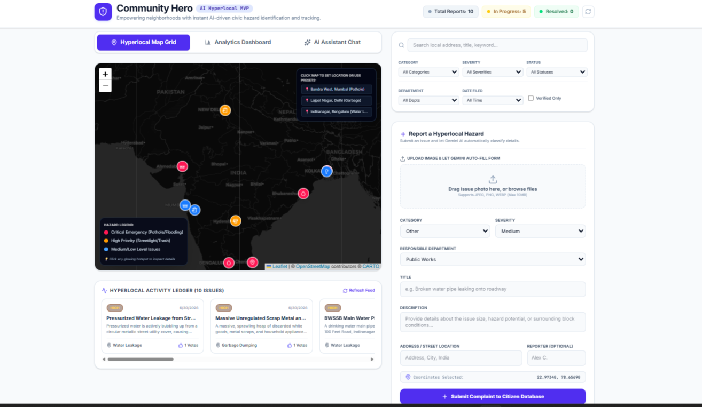
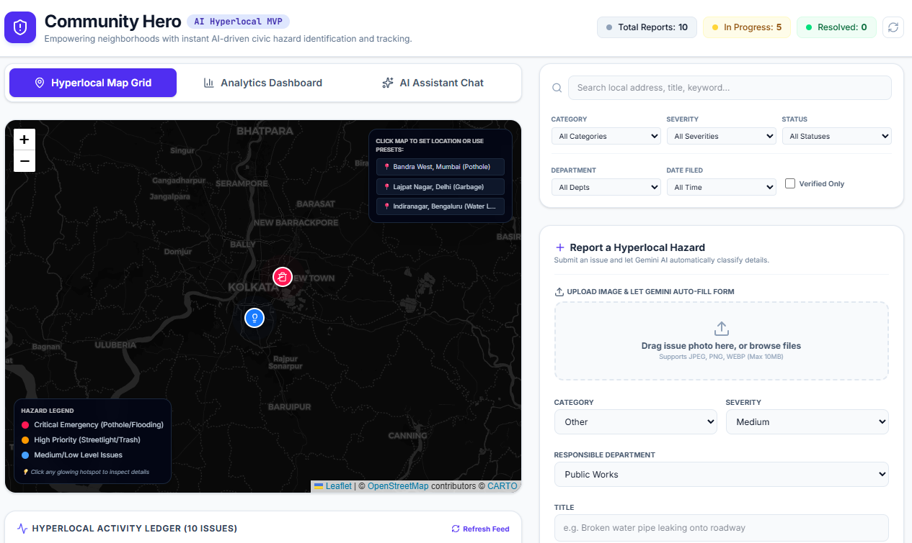
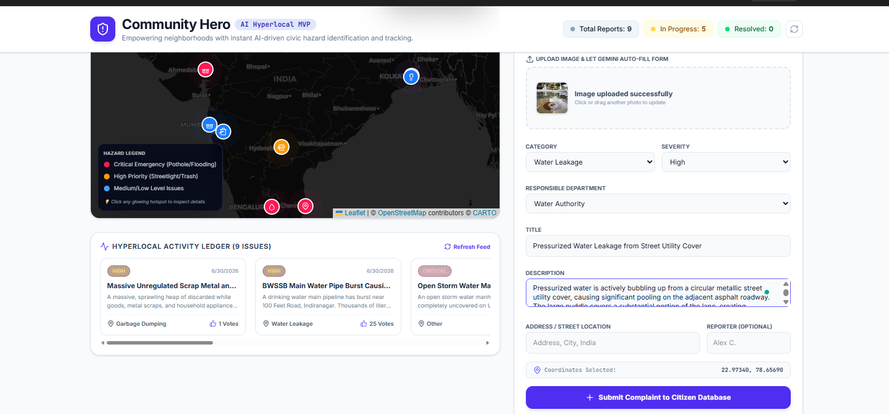
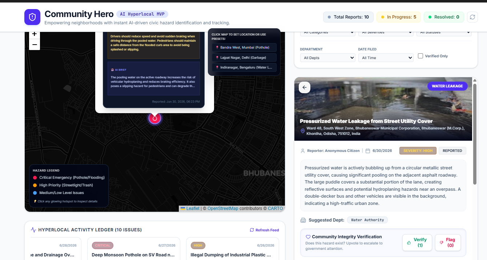
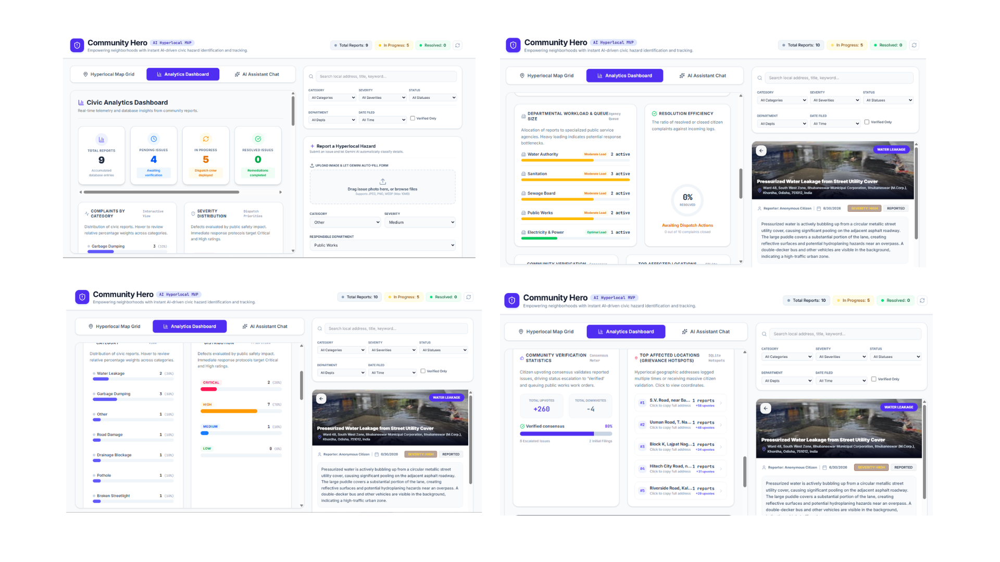
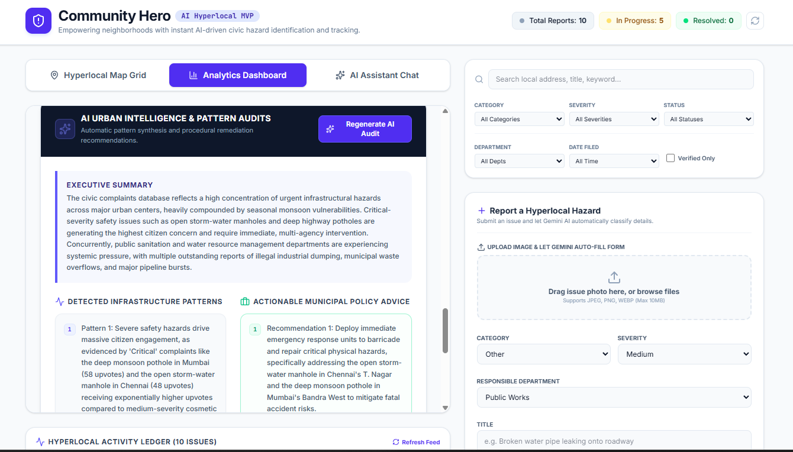
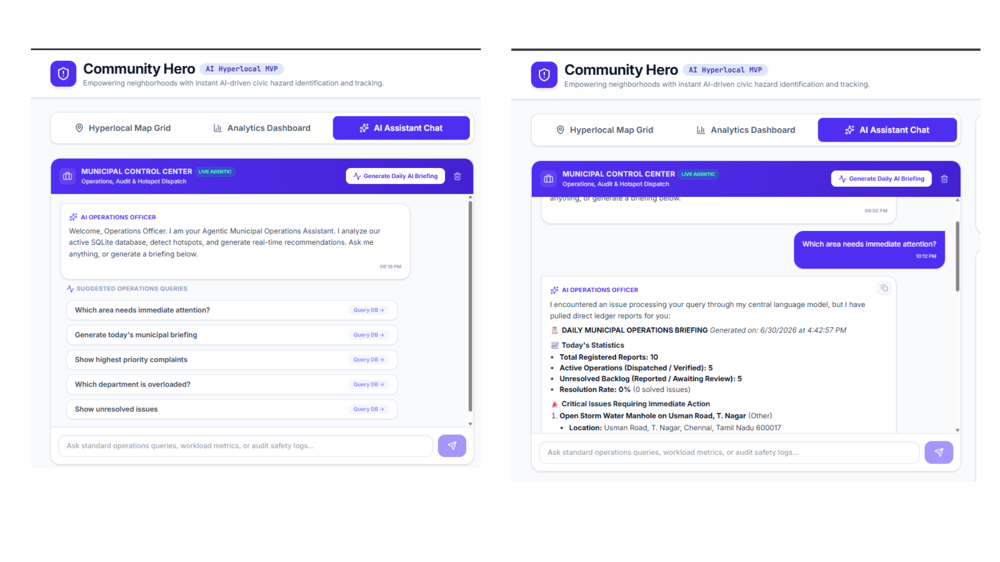

<div align="center">

</div>


# 🛡️ Community Hero

### AI-Powered Hyperlocal Civic Intelligence Platform

> **Empowering citizens and municipalities through AI-driven civic issue reporting, automated image analysis, intelligent prioritization, interactive mapping, and municipal decision support.**

---
<div align="center">


</div>

---


# 🌍 Overview

Community Hero is an AI-powered hyperlocal civic engagement platform designed to bridge the communication gap between citizens and local authorities.

Citizens can instantly report civic issues such as potholes, garbage dumping, water leakage, drainage blockage, damaged roads, and broken streetlights simply by uploading an image.

Leveraging **Google Gemini AI**, the platform automatically analyzes uploaded images, classifies the issue, predicts its severity, recommends the responsible municipal department, generates citizen safety advice, and plots the complaint on an interactive map.

Beyond complaint management, Community Hero serves as an AI-powered municipal intelligence platform that transforms civic reports into actionable insights through AI-generated briefings, analytics, hotspot detection, and decision-support tools for local authorities.

---


# 🚀 Live Demo

🔗 **Live Application**

[Launch Community Hero](https://community-hero-1053440335832.asia-southeast1.run.app/)

> **Note:** The application uses the Google Gemini API (Free Tier). If the daily API quota is exhausted, the platform automatically switches to its intelligent local fallback engine, ensuring complaint submission and core functionality remain available.

---

# 🎯 Problem Statement

Traditional civic complaint systems are often slow, fragmented, and lack intelligent prioritization. Citizens struggle to report issues efficiently, while municipalities face challenges in identifying high-priority incidents and allocating resources effectively.

Community Hero addresses this challenge by combining Artificial Intelligence, geospatial visualization, and municipal analytics into a unified platform that streamlines issue reporting and enables data-driven urban governance.

---

# ✨ Key Features

## 📸 AI Image Analysis

- Upload an image of a civic issue
- Automatic issue classification using Google Gemini AI
- Severity prediction
- Responsible department recommendation
- Citizen safety advice generation

**Supported Categories**

- Potholes
- Garbage Dumping
- Water Leakage
- Drainage Blockage
- Broken Streetlights
- Road Damage
- Public Safety Hazards

---

## 🗺️ Interactive Hyperlocal Map

Visualize reported civic issues in real time with an interactive map.

Features include:

- Live complaint markers
- Category-based filtering
- Severity visualization
- Complaint status tracking
- Search by location
- Dynamic updates

---

## 📊 Civic Analytics Dashboard

Gain operational insights through an interactive analytics dashboard.

Includes:

- Total Reports
- Pending Issues
- In Progress Cases
- Resolved Complaints
- High Priority Alerts
- Category Distribution
- Severity Breakdown
- Department Workload
- Monthly Complaint Trends
- Resolution Efficiency

---

## 🤖 AI Municipal Operations Assistant

An intelligent AI assistant capable of interacting with live complaint data.

Features include:

- Generate Daily AI Briefings
- Query live municipal data
- Identify civic hotspots
- Analyze departmental workload
- Summarize unresolved complaints
- Recommend priority actions
- Provide operational insights

---

## 🧠 AI Urban Intelligence & Pattern Audits

Transforms civic complaint data into actionable urban intelligence.

Capabilities include:

- Infrastructure Pattern Detection
- Complaint Trend Analysis
- Severity Pattern Recognition
- Department Performance Insights
- Hotspot Identification
- AI-generated Municipal Recommendations

---

## 📝 Smart Complaint Management

Citizens can:

- Submit complaints with images
- Auto-fill complaint details using AI
- Track complaint progress
- Verify existing complaints
- Filter reports
- Search complaints by location

---

# 🏗️ Project Architecture

```text
Citizen Uploads Image
        │
        ▼
Google Gemini AI Analysis
        │
        ▼
Issue Classification
        │
        ▼
Severity Prediction
        │
        ▼
Department Assignment
        │
        ▼
SQLite Database
        │
        ├────────► Interactive Map
        │
        ├────────► Analytics Dashboard
        │
        └────────► AI Municipal Operations Assistant
                          │
                          ▼
              Municipal Intelligence & Decision Support
```

---

# ⚙️ Tech Stack

### Frontend

- React
- TypeScript
- Vite
- Tailwind CSS

### Backend

- Node.js
- Express.js

### Database

- SQLite

### Artificial Intelligence

- Google Gemini API
- Google AI Studio

### Maps & Visualization

- Google Maps

### Deployment

- Google Cloud Run

---

# 📸 Screenshots

## 🏠 Home Dashboard



---

## 🗺️ Interactive Civic Map



---

## 📸 AI Image Analysis



---

## 📝 Complaint Submission



---

## 📊 Civic Analytics Dashboard



---

## 🧠 AI Urban Intelligence & Pattern Audits



---

## 🤖 AI Municipal Operations Assistant



---

# 🚀 Running the Project Locally

## 📋 Prerequisites

Before running the project, ensure you have:

- Node.js (v18 or later)
- npm
- A Google Gemini API Key

---

### 📥 Installation

Clone the repository:

```bash
git clone https://github.com/Sambit-008/community-hero.git
```

Navigate to the project folder:

```bash
cd community-hero
```

Install all dependencies:

```bash
npm install
```

---

### ⚙️ Configure Environment Variables

Create a `.env.local` file (or use the provided `.env.example` file as a reference).

```env
GEMINI_API_KEY=YOUR_GEMINI_API_KEY
APP_URL=YOUR_APP_URL
```

---

### ▶️ Run the Application

Start the development server:

```bash
npm run dev
```

The application will now be available locally in your browser.

---

# 🔒 Environment Variables

| Variable | Description |
|----------|-------------|
| `GEMINI_API_KEY` | Google Gemini API Key used for AI-powered image analysis and municipal intelligence |
| `APP_URL` | Base URL of the deployed application |

---

# 🌟 Innovation Highlights

- AI-first civic issue reporting
- Automatic image understanding using Gemini
- Hyperlocal geospatial visualization
- Intelligent municipal operations assistant
- AI-generated executive briefings
- Urban pattern analysis
- Smart department routing
- Real-time analytics dashboard
- Persistent SQLite database
- Responsive cross-device experience
- Graceful fallback mechanism during AI quota exhaustion

---

# 📈 Future Scope

- Voice-based complaint reporting
- Multi-language support
- Predictive infrastructure maintenance
- Mobile application
- IoT sensor integration
- Government portal integration
- Department performance scoring
- Citizen reputation system
- Smart City Dashboard
- AI-powered resource allocation

---

# 👨‍💻 Author

**Sambit Sinha**

- GitHub: https://github.com/Sambit-008
- LinkedIn: www.linkedin.com/in/sambit-sinha

Built for the Google AI Hackathon using Google Gemini AI and Google AI Studio.

Designed and developed as an end-to-end AI-powered civic intelligence platform to demonstrate how Generative AI can improve urban governance and citizen engagement.

---

# 💡 Vision

Community Hero is more than a complaint management platform—it's an AI-powered municipal intelligence system designed to help cities become smarter, safer, and more responsive.

By combining AI, geospatial visualization, and intelligent analytics, the platform empowers both citizens and municipal authorities to collaborate in creating cleaner, safer, and more sustainable communities.

**Because every citizen has the power to become a Community Hero.**

---


# 📄 License

This project was developed for the Google AI Studio Hackathon.

It is intended for educational, demonstration, and portfolio purposes.


<div align="center">

### ⭐ If you found this project interesting, consider giving it a star!

Made with ❤️ using **Google Gemini AI**, **React**, **TypeScript**, and **Google AI Studio**

</div>

